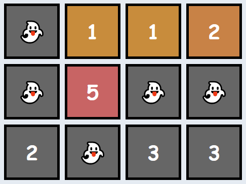

After becoming famous, the CodeBots decided to move into a new building together. Each of the rooms has a different cost, and some of them are free, but there's a rumour that all the free rooms are haunted! Since the CodeBots are quite superstitious, they refuse to stay in any of the free rooms, or any of the rooms below any of the free rooms.

Given matrix, a rectangular matrix of integers, where each value represents the cost of the room, your task is to return the total sum of all rooms that are suitable for the CodeBots (ie: add up all the values that don't appear below a 0).

### Example

- For

  ```
  matrix = [[0, 1, 1, 2], 
            [0, 5, 0, 0], 
            [2, 0, 3, 3]]
  ```
  the output should be
  `matrixElementsSum(matrix) = 9`.

  


  There are several haunted rooms, so we'll disregard them as well as any rooms beneath them. Thus, the answer is `1 + 5 + 1 + 2 = 9`.


- For

  ```
  matrix = [[1, 1, 1, 0], 
            [0, 5, 0, 1], 
            [2, 1, 3, 10]]
  ```

  the output should be
  `matrixElementsSum(matrix) = 9`.

  

  Note that the free room in the final column makes the full column unsuitable for bots (not just the room directly beneath it). Thus, the answer is 1 + 1 + 1 + 5 + 1 = 9.

### Input/Output

- [execution time limit] 4 seconds (go)

- [input] array.array.integer matrix

  A 2-dimensional array of integers representing the cost of each room in the building. A value of 0 indicates that the room is haunted.

  Guaranteed constraints:
  `1 ≤ matrix.length ≤ 5`,
  `1 ≤ matrix[i].length ≤ 5`,
  `0 ≤ matrix[i][j] ≤ 10`.

- [output] integer

  - The total price of all the rooms that are suitable for the CodeBots to live in.